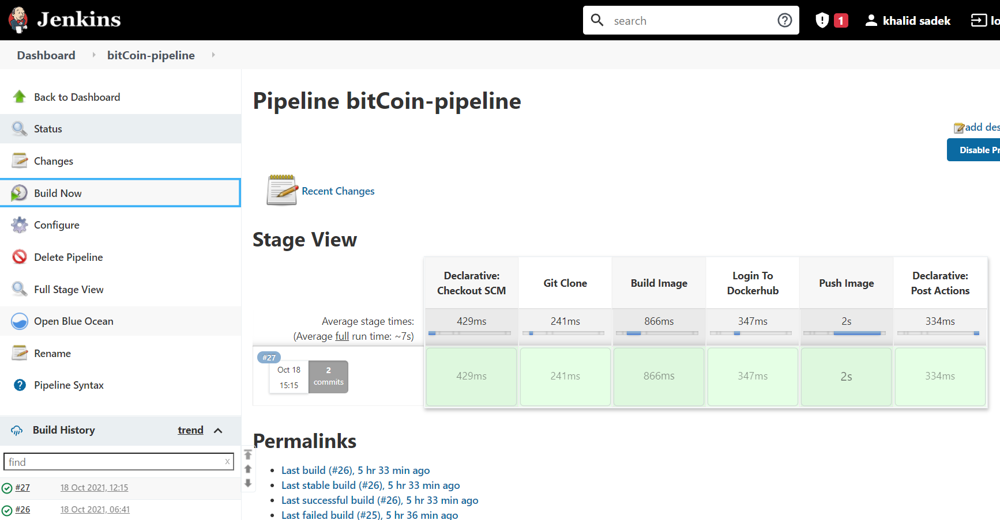
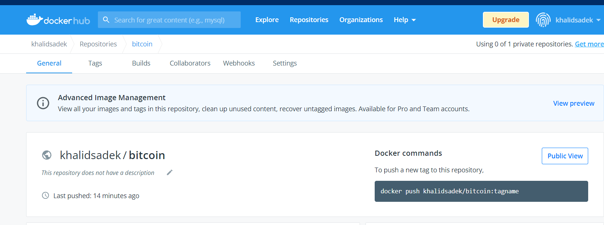
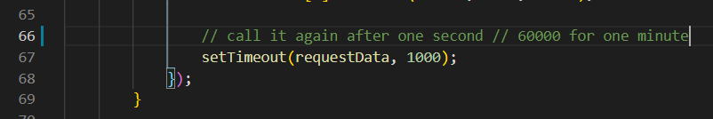

# BitCoin Live Price

## Description

Flask based Python Application :

* Presents the Current Bitcoin Price in USD
* Presents the Average Price for the last 10 minutes(in external file with auto update while running the app => realTime-bitCoin-Average.txt)

### Using :

* Docker
* API from (https://www.coindesk.com/)
* Jenkins

### DockerHub Image 
```
khalidsadek/bitcoin
```

## few screenshots 
### pipeline



### DockerHun



### application


## Note : i have set the application to get values every one second , you can change it from here




